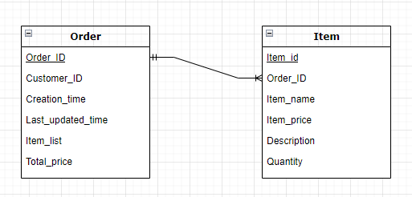

# NYU DevOps Orders


[](https://codecov.io/gh/CSCI-GA-2820-FA23-001/orders)

The orders group for the NYU DevOps and Agile Methodologies class!
This code aims to allow any customer to set up their order.
This will include all the necessary functions for a customer to be able to manage their order, including:

* After the customer clicks place order button, it would call our API to create an order and add all the items in the order.
* They will be able to check their order to see all of the items that are currently in the order.
* They will be able to update items within their order if they want to purchase more or less of that certain item.
* They will be able to delete items they no longer want from their order.
* They will be able to view past purchases and see what they have previously bought.

## Build

Information on how to build and test the code yourself, if you choose to do so:

1. Obtaining the code for this repository:
    * Clone the code for the repository onto your local machine, using the git CLI, GitHub Desktop, or any method of choice.
    * Navigate into the project directory `./orders`
2. Build and run the code
    * Make sure you have Docker Desktop or any other similar container service running.
    * Open the repository in a dev container, this will allow you to run all of the code.

## Information about the routes of this repository

These are the RESTful routes for `orders`

```text
Endpoint       Methods  Rule                                      
-------------  -------  ------------------------------------------
create_orders  POST     /orders                                   
delete_orders  DELETE   /orders/<int:order_id>                    
index          GET      /                                                       
list_orders    GET      /orders                                   
read_orders    GET      /orders/<int:order_id>                    
static         GET      /static/<path:filename>                   
update_orders  PUT      /orders/<int:order_id>
```

These are the RESTful routes for the `items` within orders

```text
Endpoint       Methods  Rule                                      
-------------  -------  ------------------------------------------
create_items   POST     /orders/<int:order_id>/items                                              
delete_items   DELETE   /orders/<int:order_id>/items/<int:item_id>                   
get_items      GET      /orders/<int:order_id>/items/<int:item_id>                                     
list_items     GET      /orders/<int:order_id>/items                                              
update_items   PUT      /orders/<int:order_id>/items/<int:item_id>
```

The test cases have at least 95% test coverage, ensuring most of the repo is covered and following test-driven-development.

## Testing

1. Make sure you have the repository container running on your computer first, before attempting to test the code.
    * Navigate to the root of the repository, you should be in `./app`.
2. Run `make test`. This will run all of the tests for the code within the `./tests` folder, and check for any errors.
    * Similarly, you can also run `make lint` in the root folder to test if the code conforms to PEP8 standards.

If you want to contribute to our code, here are the related guidelines: [Link](./CONTRIBUTING.md)

## Our core development team

* Matthew Dong [GitHub](https://github.com/Matt-J-Dong)
* Viraj Parikh [GitHub](https://github.com/VirajYParikh)
* Zhao Yang [GitHub](https://github.com/JooooosephY)
* Rahul Patel [GitHub](https://github.com/rahul-m-patel)
* Yujing Zhang [GitHub](https://www.google.com/)

## Database Schema



### Order Class Functions

* Instance methods
  * serialize() - Serializes an Order into a dictionary
  * deserialize(data) - Deserializes an Order from a dictionary
    * Args: data (dict): A dictionary containing the resource data
  * get_total_price() - It can calculate the total price of the order
  * create() - Creates an Order to the database
  * update() - Updates an Order to the database
  * delete() - Deletes an Order in the database
* Class methods
  * init_db(app) - Initializes the database session
    * Args: app: flask app
  * find_by_customer_id() - Returns all Orders with the given customer_id
  * all() - Returns all of the records in the database
  * find(by_id) - Finds a record by it's ID
    * Args: by_id (int): the given order ID

### Item Class Functions

* Instance methods
  * serialize() - Serializes an Item into a dictionary
  * deserialize(data) - Deserializes an Item from a dictionary
    * Args: data (dict): A dictionary containing the resource data
  * create() - Creates an Item to the database
  * update() - Updates an Item to the database
  * delete() - Deletes an Item in the database
* Class methods
  * init_db(app) - Initializes the database session
    * Args: app: flask app
  * all() - Returns all of the items in the database
  * find(by_id) - Finds a record by it's ID
    * Args: by_id (int): the given item ID

## License

Copyright (c) John Rofrano. All rights reserved.

Licensed under the Apache License. See [LICENSE](LICENSE)

This repository is part of the NYU masters class: **CSCI-GA.2820-001 DevOps and Agile Methodologies** created and taught by *John Rofrano*, Adjunct Instructor, NYU Courant Institute, Graduate Division, Computer Science, and NYU Stern School of Business.
